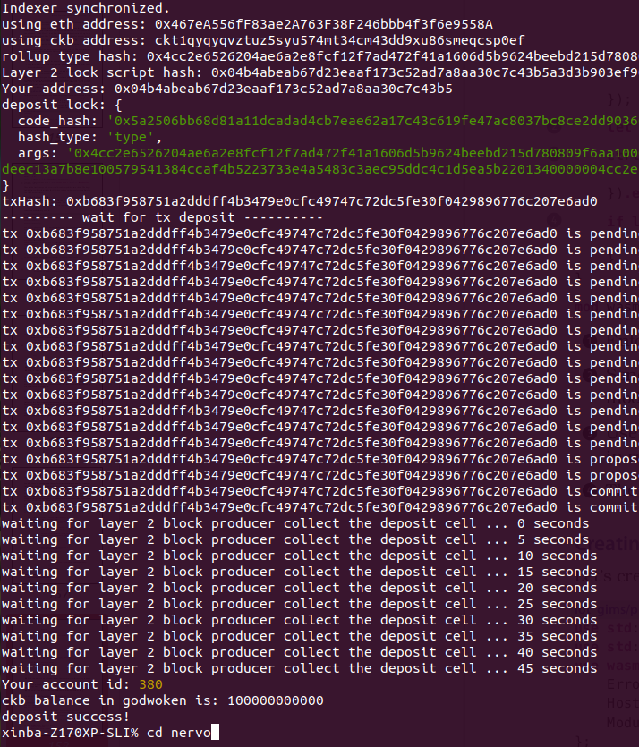

# Gitcoin: 0) Setup a Local CKB Node and CKB Indexer for the Testnet

## 1. Setup a CKB Node


## 2. Setup a CKB Indexer


# Gitcon1: 1)

## 1. A screenshot of the accounts you created 


## 2. A link to the Layer 1 address you funded on the Testnet Explorer

https://explorer.nervos.org/aggron/address/ckt1qyqyqvztuz5syu574mt34cm43dd9xu86smeqcsp0ef

## 3. A screenshot of the console output immediately after you have successfully submitted a deposit to Layer 2




# Gitcoin: 2) Deploy A Simple Ethereum Smart Contract On Polyjuice

## 1. A screenshot of the console output immediately after you have successfully deployed a smart contract.


## 2. The transaction hash from the contract deployment (in text format).

0xfdcbd95f408cc639454855ad32cd8fbd5236c546f9c95651d006c34d20cd9135

## 3. The deployed contract address from the contract deployment (in text format).

0xBBEaFABf6CA88509E7f6F4b7670b38ff72c7b5A8

# Gitcoin: 3) Issue A Smart Contract Call To The Deployed Smart Contract

## 1. A screenshot of the console output immediately after you have successfully issued a smart contract call.


## 2. The transaction hash from the console output (in text format).

0x3ef91e3620bb7f72ed0de19a4be0f4f4d455727fd120986d0636df9763d8053c
## 3. The contract address that you called (in text format).

0xBBEaFABf6CA88509E7f6F4b7670b38ff72c7b5A8

## 4. The ABI for contract you made a call on (in text format).

```
abi = [
    {
      "inputs": [],
      "stateMutability": "payable",
      "type": "constructor"
    },
    {
      "inputs": [
        {
          "internalType": "uint256",
          "name": "x",
          "type": "uint256"
        }
      ],
      "name": "set",
      "outputs": [],
      "stateMutability": "payable",
      "type": "function"
    },
    {
      "inputs": [],
      "name": "get",
      "outputs": [
        {
          "internalType": "uint256",
          "name": "",
          "type": "uint256"
        }
      ],
      "stateMutability": "view",
      "type": "function"
    }
  ];
```

# Gitcoin: 4) Issue An SUDT Token On Layer 1 And Deposit It To Layer 2

## 1. A link to the Layer 1 address you funded on the Testnet Explorer.

https://explorer.nervos.org/aggron/address/ckt1qyqyqvztuz5syu574mt34cm43dd9xu86smeqcsp0ef
## 2. A screenshot of the console output immediately after using sudt-cli to create your SUDT tokens on Layer 1.


## 3. A link to the transaction ID created by sudt-cli on the Testnet Explorer.

https://explorer.nervos.org/aggron/transaction/0xc3857f7b32106ea7a31f988807be740cdd91007395aff9c23e9d4b645bdf026a
## 4. A screenshot of the console output immediately after you have successfully submitted a deposit to Layer 2 using the account-cli tool.


## 5. The SUDT ID from the console output after executing the deposit script (in text format).

392

# Gitcoin: 5) Deploy The ERC20 Proxy Contract For The Deposited SUDT

## 1. A screenshot of the console output immediately after deploying smart contract.


## 2. The address of the ERC20 Proxy Contract you deployed (in text format).

0xE674ae36a9242Ca285E1BBcf8e9973B4B72C0333

## 3. A screenshot of the console output immediately after checking your SUDT balance.


## 4. The Ethereum address that was checked (in text format).

0x467eA556fF83ae2A763F38F246bbb4f3f6e9558A

# Gitcoin: 6) Use Force Bridge To Deposit Tokens From Ethereum To Polyjuice

## 1. A screenshot of the console output immediately after you have successfully generated your Deposit Receiver Address.


## 2. Your Deposit Receiver Address (in text format).

ckt1q3dz2p4mdrvp5ywu4kk5edl2uc4p03puvx07g7kgqdau3n3dmypkqnxzuefxyp9wdghglncj77k5wt6p59sx6kukyjlwh5s467qgp8m25yqqqqqsqqqqqvqqqqqfjqqqqp9252w6analwy5q0ednz2vag5t6pfe3x97f2pu6z2akzwegrt6cs6gqqqqpqqqqqqcqqqqqxyqqqqx7asf60w8pqpte2sfcfn90fdfzxue7ff2g8sawe9wacnqat6jmygqngqqqqpxv9ejjvgz2u63w3l839aadguh5rgtqd4devf97a0fpt4uqsz0k53n754t0lqaw9fmr7w8jg6amfulka92c5q9rqgqqqqqqcq46cweq

## 3. The Ethereum address used to generate the Deposit Receiver Address (in text format).

0x467eA556fF83ae2A763F38F246bbb4f3f6e9558A

## 4. A link to the Etherscan explorer for the successful Force Bridge transaction. This can be found on Force Bridge under History→Succeed.

https://rinkeby.etherscan.io/tx/0x8bed5aa59e046a8913157b15fe3844e5faa6e371b2d987db701e4744d835d520
## 5. A link to the Nervos explorer for the successful Force bridge transaction. This can be found on Force Bridge under History→Succeed.

https://explorer.nervos.org/aggron/transaction/0xe90541523e93f6c206e8b0a70a1c794a5bb6752086baac88aaa452064b9a5cfe